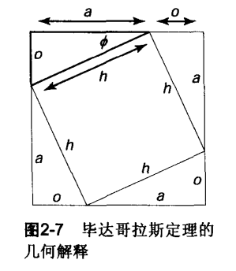
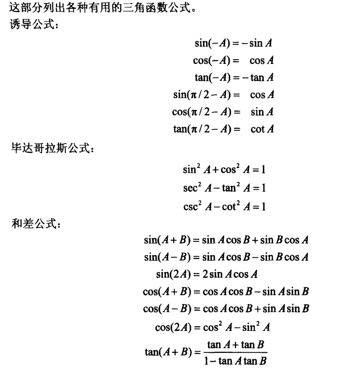
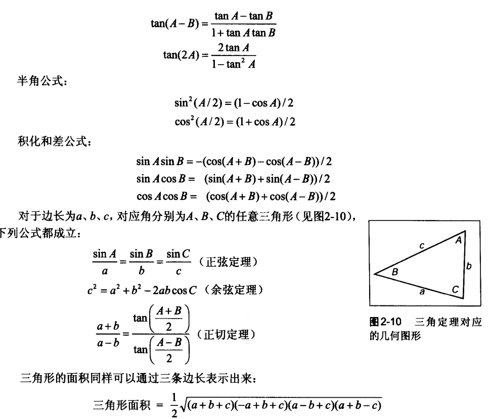

### 2.2解二次方程
$$A^{2} +Bx+C=0$$
- 1. 方程两边同时处以$A$:
$$x^{2} +\frac{B}{A} x+\frac{C}{A}=0$$
- 2. 配方：
$$(x+\frac{B}{2A} )^{2} -\frac{B^{2}}{4A^{2}} +\frac{C}{A} =0$$
- 3. 将常数项移到方程的右边，两边进行开平方：
$$x+\frac{B}{2A}=\pm \sqrt{\frac{B^{2}}{4A^{2}}-\frac{C}{A}}$$
- 4. 两边同时减去$\frac{B}{2A}$，然后以$2A$做分母进行通分就得到我们常见的形式：
$$x=\frac{-B\pm \sqrt{B^{2}-4AC}}{2A}$$
- 5. 判断是否有解，可以判断$D$
$$D=B^{2}-4AC$$
***
### 2.3.1角
$$角度=\frac{180}{\pi } *弧度$$
$$弧度=\frac{\pi}{180} *角度$$
***
### 2.3.2三角函数

$$\sin \phi =\frac{o}{h}$$
$$\csc \phi =\frac{h}{o}$$
$$\cos \phi =\frac{a}{h}$$
$$\sec \phi =\frac{h}{a}$$
$$\tan \phi =\frac{o}{a}$$
$$\cot \phi =\frac{a}{o}$$
***
### 2.3.3三角函数诱导公式
  
  
***
### 2.4向量
**单位向量：** 长度为1的向量
**零向量：** 长度为0的向量

